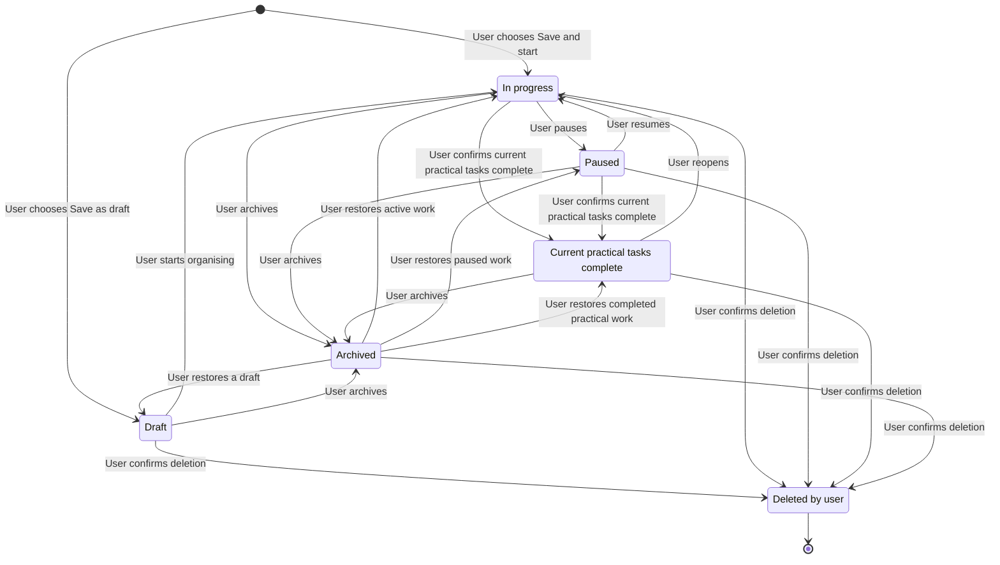

# Estate Administration Support — v1

## 1. Document status

**Status: Draft — Product and Technical Specification.**

This document is a proposal for a future workstream. It is explicit that:

- **This is not implemented.** No Estate Administration code, type, classifier
  signal, pack, route, fixture, or test exists in the repository today.
- **This is not public.** Nothing described here is routed through the public
  Check a message flow. Any prototype would be hidden and controlled-beta gated.
- **This does not change the current roadmap milestone.** The active milestone
  remains "Pilot readiness and closed real-user validation" (`TASKS.md` line 20;
  `ROADMAP.md` lines 188–197). This document does not modify `ROADMAP.md` or
  `TASKS.md`, and does not add a specialist category during the pilot cycle
  (`TASKS.md` line 148).
- **Implementation requires separate approval.** Building any part of this
  requires an explicit, separate go-ahead and, for public exposure, an explicit
  roadmap change first.
- **External authoritative research is still required before public use.** Every
  jurisdiction, process, terminology, deadline, tax, benefits, pension, and
  signposting detail in this document is a *product proposal or placeholder* and
  must be verified against authoritative sources before any pilot or public
  release (see §27).

Truth-labels used throughout:

- **[Repo truth]** — verifiable from the current repository.
- **[Inference]** — reasoned from repository evidence.
- **[Proposal]** — product/technical proposal, not implemented.
- **[External]** — requires authoritative external research before use.

Precedence: where anything here conflicts with `AGENTS.md`, `THE_COVENANT.md`,
`ARCHITECTURE.md`, `ROADMAP.md`, or `TASKS.md`, those files win and this
document is wrong and must be corrected.

Related prior work: `docs/specs/active/source-grounded-general-admin-analysis.md`
(the source-grounding invariant this workstream depends on).

## 2. Executive summary

**[Proposal]** Estate Administration is a proposed future capability that helps a
person organise the practical paperwork that follows a death. It would explain
documents, show what each organisation appears to request, track organisations
and their status, prepare questions, checklists and drafts for the user to
approve, preserve evidence, and signpost official support — all while keeping the
human in control and making no legal, tax, benefits, or entitlement decisions.

The central new idea is an **Estate Workspace**: a calm aggregate that groups
many bereavement-related documents, organisations, evidence items, timeline
events, and prepared actions under one "after a death" context — a proposed,
additive extension of the current one-item-to-one-case model.

The capability sits inside AdminAvenger's highest-caution zone. It is explicitly
a "Controlled High-Risk Areas Later" item (`ROADMAP.md` line 371: "Probate and
conveyancing administration") and a long-term "carefully controlled" direction
(`VISION.md` lines 280–282, which names "bereavement administration"). This
document therefore specifies a hidden, staged, deferred build — not a pilot
feature.

## 3. Product problem

**[Proposal]** After a death, an ordinary person suddenly becomes the informal
administrator of a stranger's-worth of paperwork: registration letters, bank and
pension forms, Tell Us Once, probate correspondence, utilities, insurers,
funeral invoices, HMRC and DWP letters, and more. Each organisation asks for
different evidence, uses different language, and sets different (or no) time
pressures. The user must understand each letter, remember what was asked, track
what they have done across a dozen organisations, and repeatedly re-explain the
same facts — while grieving.

The product promise:

> **AdminAvenger helps organise the practical paperwork after someone dies.** It
> explains documents, shows what appears to be requested, tracks organisations,
> prepares next steps, and keeps the user in control.

It does **not** decide anything legal, tax, benefits, or entitlement related, and
it is not probate software, legal/tax/benefits advice, counselling, or an
autonomous estate administrator (see §6).

## 4. Product principles

**[Repo truth]** These are inherited, not invented:

- **AI prepares. Humans decide.** / "AI remembers. AI explains. Humans decide."
  (`THE_COVENANT.md` line 5; `AGENTS.md` line 3).
- **AI extracts facts. Code assesses. Human approves.** (`ARCHITECTURE.md`
  lines 14–17).
- **No silent action.** No sending, submitting, cancelling, contacting, closing,
  or paying automatically (`THE_COVENANT.md` line 13; `ARCHITECTURE.md`
  lines 36–37, 367–382).
- **Source-grounding.** No date, amount, status, deadline, requested document,
  authority, or action may be presented as a source fact unless supported by the
  submitted text or clearly labelled as general guidance
  (`docs/specs/active/source-grounded-general-admin-analysis.md`).
- **User ownership + deletion means deletion** (`THE_COVENANT.md` lines 15–39).
- **Uncertainty is never hidden** (`TASKS.md` lines 155–156).
- **Possible money is not confirmed money** (`ARCHITECTURE.md` lines 314–321).

## 5. Current repository truth

**[Repo truth]** What exists today and is reusable (citations):

- **One front door**: `src/views/HomeView.tsx`; shared handoff `submitAcceptedText`
  (`ARCHITECTURE.md` line 76); `src/services/analysisService.ts` →
  `analyseAdminItem(item, { accessMode })` in `src/lib/mockAnalysis.ts`.
- **Intake / OCR**: DOCX via `mammoth`, selectable PDF via `pdfjs-dist`, image
  OCR via Tesseract (`ARCHITECTURE.md` lines 59–70); `src/lib/documentFileText.ts`,
  `src/lib/photoOcr.ts`, `src/lib/ocrKeyDetails.ts`.
- **Classification**: `src/lib/decisionEngine/classifier.ts`
  (`classifyDecisionDocument`); `src/lib/decisionEngine/decisionEngine.ts`;
  modules in `src/lib/decisionEngine/modules/`.
- **DecisionResult / Result View Model**: `src/lib/decisionEngine/types.ts`
  (`documentType, directAnswer, plainEnglishSummary, confidence, uncertainty,
  cannotKnow, evidenceNeeded, deadlines, risks, nextSteps, draftMessage,
  safetyNotes, amountTreatment, sourceFacts`); `src/lib/resultViewModel.ts`
  (`buildResultViewModel`, `validateResultViewModelSafety`).
- **Source-grounding**: `src/lib/sourceSupport.ts` (`isSupportedBySource`),
  `src/lib/generalAdminExtraction.ts` (typed date/money roles, `DocumentStatus`,
  negation spans), `src/lib/currencyGrounding.ts`.
- **Cases / evidence / timeline / chase**: `src/lib/caseFactory.ts`
  (`createAdminCase`); `AdminCase`, `EvidenceItem`, `CaseTimelineEvent`,
  `AdminDraft` in `src/types.ts`; `src/lib/chaseEngine.ts` (`getDefaultChaseDate`,
  `chaseDate`); `src/lib/storage.ts`; `src/lib/localDataControl.ts`.
- **Drafts / checklists**: `src/lib/messageDrafts.ts`, `src/services/draftService.ts`.
- **Exports**: `src/lib/exportCase.ts` (Case Evidence Pack);
  `src/lib/adviserExportPack.ts` + `src/lib/adviserExportDownload.ts` (Adviser
  Export Pack) — local downloads only.
- **Safety wording**: `src/lib/safetyWording.ts`;
  `src/lib/__tests__/safetyWordingRegression.test.ts`.
- **Public-scope + controlled gating**: `src/lib/publicScopePolicy.ts`
  (`assessPublicIntakeScope`, `PublicScopeBoundary`, `PublicScopeBoundaryReason`,
  `getPublicViewAvailability`, `isControlledFeatureEnabled` via
  `VITE_ENABLE_CONTROLLED_BETAS`, `controlledBetaViews`).
- **Controlled pack model to mirror**: `src/lib/communityHelperPack.ts`,
  `src/lib/workplaceSupportPack.ts` (`ARCHITECTURE.md` lines 171–172).
- **Corpus harness**: `HARNESS.md`; `tests/e2e/corpus-runner.spec.ts` (synthetic
  additions only; never copies private corpus into the repo).

**[Repo truth]** What does **not** exist: any implemented
bereavement/death/estate/probate keyword, classifier signal,
`DecisionDocumentType` member (`src/lib/decisionEngine/types.ts` lines 1–27 has
none), pack, fixture, or test. Apart from this unapproved draft, the product
direction is only the `VISION.md` line 281 aspiration. A death-related letter
today falls to the **generic** `unknown_admin_dispute` / unknown finding — a
generic fallback, **not** a specialist capability.

## 6. Non-goals

**[Proposal]** Estate Administration is **not**, and must not be positioned as:
probate software; legal advice; tax advice; benefits advice; bereavement
counselling; or an autonomous estate administrator. It does not decide legal
rights, probate requirements, tax liability, benefits entitlement, estate
distribution, debt validity, or who has legal authority to act (full forbidden
list in §17). v1 explicitly excludes any Inheritance and Benefits Impact Check
beyond identification and signposting (§19). It adds no public route, no category
selector, and no new specialist engine to the pilot.

## 7. Target users and contexts

**[Proposal]**

- **Primary**: a bereaved next-of-kin or informal helper dealing with practical
  admin after a death, often grieving, time-pressured, and not legally trained.
- **Secondary**: a friend/relative helping someone else ("the person you are
  helping"), or a support worker/adviser assisting (adviser export already
  exists). The user is **not assumed** to be the executor, administrator, or
  personal representative.
- **Contexts**: mobile-first, low cognitive load, intermittent sessions over
  weeks/months, one document at a time, sensitive content. Local-first, offline,
  no account required (consistent with `ARCHITECTURE.md` lines 88–94).

## 8. Estate Workspace concept

**[Proposal]** Today the model is one `AdminItem` → one `AdminFinding` → one
`AdminCase` (`ARCHITECTURE.md` lines 96–109, 264–275). Estate administration is
inherently *many documents across many organisations about one death*. The
Estate Workspace is a proposed **additive aggregate** that groups related cases,
organisations, evidence, timeline events, and prepared actions under one "after a
death" context.

An Estate Workspace can organise: the person who died; the user's relationship to
them; key dates; organisations; uploaded documents; evidence; requested actions;
status; timelines; chase dates; prepared questions; prepared drafts;
user-confirmed outcomes; and exports. Any bereavement-related document may later
be *linked* to one Estate Workspace — never silently; always by user choice
(§9 Journey C).

**This aggregate is not implemented.** It is a proposed extension of the
one-item-to-one-case model. Recommended data shape and migration risk are in §20.

### Naming and user-facing language

**[Proposal]** `EstateWorkspace` is the technical/domain name used in this
specification. The primary user-facing name should be **Practical admin after a
death**, shortened to **After a death** where navigation space is limited.
“Estate” may imply a legal estate, probate, property, wealth, or authority the
user may not have; it should therefore appear in user-facing copy only when the
source uses it, the user chooses it, or the legal context genuinely needs the
term. “Workspace” is acceptable supporting language but should not be the first
thing a grieving user has to understand.

Default and preferred copy:

- page title: **Practical admin after a death**;
- saved-list group: **After a death**;
- default workspace label: **Practical admin after a death**;
- add action: **Add to after-a-death admin**;
- export action: **Download practical admin pack**;
- completion action: **Mark current practical tasks complete**;
- reopening action: **Reopen practical admin**;
- neutral person reference: **the person who died**;
- control reminder: **Nothing is sent, saved, linked, or marked complete until
  you choose.**

Avoid: “complete the estate”, “estate settled”, “probate complete”, “executor
dashboard”, “case closed”, “all done”, “success”, and celebratory copy. Do not
call the user an executor, administrator, or personal representative unless the
user or a source explicitly supplies that wording, and even then preserve it as
a sourced/user statement rather than an AdminAvenger conclusion.

## 9. Core user journeys

**[Proposal]** All journeys preserve: nothing saved until the user chooses; no
automatic status changes; source-grounded facts only.

### Journey A — first bereavement document
1. User pastes, uploads, or photographs a document (existing intake).
2. AdminAvenger silently detects likely bereavement context (classifier signals,
   §10) — the user never picks a category.
3. The result explains what the document appears to be, answering the five
   visible questions (§11).
4. It shows: what this is; what changed or matters; whether the source shows
   anything time-sensitive (only if source-stated); what the organisation appears
   to request; what the user may want to have ready; and uncertainty / missing
   information / cannot-know.
5. The user may: keep it as a standalone result; add it to an existing Estate
   Workspace; or create a new Estate Workspace.
6. **Nothing is saved until the user chooses to save.**

### Journey B — create Estate Workspace manually
- **Minimum required fields**: none beyond a workspace label (which may default
  to “Practical admin after a death”). The system must not require a name,
  relationship, dates, or jurisdiction.
- **Optional fields**: deceased display label, relationship, jurisdiction, date
  of death, date registered, notes.
- **Privacy language**: "You only need to add what helps you. You can leave any
  of this blank, and change or delete it later."
- **No unnecessary collection**; **no assumption** the user is executor or
  administrator (§13, §17).

### Journey C — add another document
- After analysing a new document, the product *proposes* a likely Estate
  Workspace and/or organisation match (“This may belong with [workspace] /
  [organisation]. Add it?”) but **does not silently save or attach it**.
- An unsaved preview offers a single explicit **Save and add** action. That
  action atomically creates the ordinary `AdminCase` and its confirmed workspace
  link. Cancelling or leaving the preview creates neither.
- The user confirms, chooses a different workspace/organisation, or keeps it
  standalone. Matching rationale is shown as a product suggestion, not a fact.
- A saved item may belong to at most one Estate Workspace in v1. Reassigning it
  requires confirmation and must name both the current and destination
  workspaces. One document may be associated with zero or more organisations
  *inside that workspace* because a letter may concern several organisations.
- Unlinking removes the link and any workspace-derived copies while preserving
  the independently saved case. Deleting the case removes its link and clears or
  recomputes any “latest document” pointer. Detailed linking rules are in §20.

### Journey D — requested evidence
The result must clearly separate three tiers (distinct labels, no blending):
- **Requested by this document** — evidence the *source text* explicitly asks
  for, each with a source quote (source-grounded).
- **You may want to prepare** — product suggestion, clearly labelled as
  AdminAvenger's suggestion, not a source requirement.
- **General guidance to check** — official-guidance-style pointers, labelled as
  general guidance, deferred until §27 research is approved.

### Journey E — chase and waiting
- Workflow status changes are **user-confirmed only**. For example, when the user
  taps “I sent this”, the product records an `evidence_sent_by_user` observation
  and may ask whether to change the workflow status to `waiting`; it does not
  make that second change silently. The product never marks reported/sent/
  received/acknowledged on its own.
- Chase dates reuse `chaseEngine.ts` for the user-controlled workflow, but a
  computed chase date is **never** shown as a source deadline (per the
  source-grounding spec). A "suggested follow-up" is labelled as AdminAvenger's
  suggestion.

### Journey F — completion
- At organisation level, “Current task complete” means **the user confirmed
  their current practical task with that organisation is complete**.
- At workspace level, “Current practical tasks complete” means **the user
  confirms the practical administration tasks they are currently tracking are
  complete**. It does not claim that every possible task has been found.
- Neither label means probate is complete, the estate is legally administered,
  tax affairs are settled, debts are resolved, beneficiaries are identified or
  paid, or ownership has been determined. The confirmation copy must state this
  scope before the transition is saved.

### Journey G — export (Practical Admin Pack)
Local, browser-side (mirrors `exportCase.ts` / `adviserExportPack.ts`). Contains:
organisation summary; evidence list; open actions; timeline; questions for an
adviser; and source provenance. It carries a **prominent disclaimer**: "This pack
was prepared by you with AdminAvenger's help. It is a personal organiser, not
legal proof, and not a legal or tax document." No upload/email/submit.
`EstateExportModel` may remain the technical name; “Estate Administration Pack”
must not be the leading user-facing label.

## 10. Document taxonomy

**[Proposal]** Proposed families. Classifier signals are **proposals only** and
must be validated ([External]). For every family the same safe/forbidden rules
apply: extract only source-stated facts with quotes; never assert a document is
legally required, never assert authority/entitlement/tax/benefit conclusions;
show uncertainty; escalate where listed.

For brevity, each family below lists: **signals** (proposed) · **conflicts** ·
**facts that may be extracted** · **evidence that may be requested** ·
**escalation**. *Safe outputs* = explain, extract source facts, list requested
evidence, prepare questions/checklist/draft, signpost. *Forbidden outputs* = the
§17 list (never repeated per family).

1. **Death registration / registrar** — signals: "register a death", "registrar",
   "certified copy of the death certificate", "medical certificate of cause of
   death". Conflicts: generic council letters. Facts: registration office, date
   registered, number of certified copies, reference. Evidence: death
   certificate. Escalation: coroner/inquest wording → specialist help.
2. **Tell Us Once** — signals: "Tell Us Once", reference code, list of notified
   departments. Conflicts: individual DWP/HMRC letters. Facts: reference,
   departments listed, date. Evidence: usually none requested. Escalation: none
   typical.
3. **Probate registry / court correspondence** — signals: "probate registry",
   "grant of probate", "letters of administration", "grant of representation",
   case/reference number. Conflicts: solicitor letters; generic court letters.
   Facts: reference, office, visible dates, what is requested. Evidence: will,
   death certificate, ID. Escalation: **always** — probate is high-risk; never
   state whether probate/a grant is required or who may apply.
4. **Banks & building societies** — signals: "bereavement team", "deceased
   account", "freeze", "date of death balance". Conflicts: ordinary bank letters;
   fraud/phishing (must trip email-safety first). Facts: account reference,
   requested documents, bereavement-team contact shown in source. Evidence: death
   certificate, grant, ID, proof of address. Escalation: joint accounts;
   suspected fraud.
5. **Pensions** — signals: "pension", "annuity", "death benefit", "nomination".
   Facts: scheme/provider name, reference, requested forms. Evidence: death
   certificate, birth/marriage certificate. Escalation: death-benefit
   nomination/tax wording → specialist.
6. **Insurers** — signals: "life insurance", "claim", "policy number". Facts:
   policy number, claim reference, requested documents. Evidence: death
   certificate, policy documents. Escalation: disputed/declined claims.
7. **Employers** — signals: "employer", "final pay", "death in service". Facts:
   employer name, references. Evidence: death certificate. Escalation:
   death-in-service benefit/tax wording.
8. **HMRC / tax correspondence** — signals: "HMRC", "tax return", "estate",
   "inheritance tax", "IHT". Conflicts: the existing HMRC tax-code notice engine.
   Facts: references, visible dates, what is requested. Evidence: as source
   states. Escalation: **always** for IHT/estate-tax — never calculate or
   conclude tax liability.
9. **DWP / benefits correspondence** — signals: "DWP", "benefit", "overpayment",
   "bereavement support payment". Conflicts: existing controlled benefits engines.
   Facts: references, visible dates, requested info. Escalation: **always** —
   benefits are controlled/high-risk (§19); never determine entitlement or
   overpayment.
10. **Council tax** — signals: "council tax", "single person discount", "exempt".
    Facts: account reference, requested info. Escalation: none typical.
11. **Utilities / water** — signals: "energy", "water", "final bill", "account
    holder has died". Conflicts: existing energy price-change engine. Facts:
    account reference, final balance shown. Escalation: none typical.
12. **Mortgage & property** — signals: "mortgage", "title", "Land Registry",
    "conveyanc". Facts: account/title references. Escalation: **always** —
    conveyancing is high-risk (`ROADMAP.md` line 371); jointly owned property.
13. **Landlords / housing associations** — signals: "tenancy", "notice",
    "possession". Facts: references, visible dates. Escalation: eviction/
    possession/urgent housing consequences → urgent specialist help.
14. **Funeral invoices / funeral plans** — signals: "funeral director",
    "invoice", "funeral plan". Facts: amount due (display-only), reference, due
    date if source-stated. Evidence: the invoice itself. Escalation: disputed/
    unaffordable funeral costs → signpost funeral-cost support ([External]).
15. **Estate debts** — signals: "outstanding balance", "the estate is liable",
    "creditor". Facts: creditor, amount (display-only), reference. Escalation:
    **always** — never decide whether a debt is valid or payable; significant/
    disputed debts and possible insolvency.
16. **Subscriptions & telecoms** — signals: "subscription", "mobile", "broadband",
    "account holder". Conflicts: existing subscription/broadband reads. Facts:
    account reference, cancellation wording. Escalation: none typical.
17. **Solicitor / professional adviser correspondence** — signals: "solicitor",
    "firm", "our client", "estate account". Facts: firm name, reference, what is
    requested. Escalation: **always** signpost that a solicitor is already
    involved; do not second-guess legal advice.
18. **Beneficiary correspondence** — signals: "beneficiary", "legacy",
    "distribution". Facts: references, what is requested. Escalation: disputes;
    never determine shares/entitlement.
19. **Digital accounts** — signals: "memorialise", "account of a deceased user",
    "digital legacy". Facts: platform, reference, requested proof. Escalation:
    none typical.
20. **Unknown bereavement-related correspondence** — signals: bereavement context
    detected but family unclear. Behaviour: safe generic bereavement result +
    strong uncertainty + "have the letter to hand" + offer to save to a
    workspace. Never guess the organisation type as fact.

**Cross-cutting conflict rule** [Proposal]: suspicious/phishing signals take
precedence over bereavement routing (email-safety first); and an ordinary
document that merely *mentions* an estate or that someone died must **not** be
routed as bereavement unless bereavement-administration signals are present
(§18 negative fixtures).

## 11. Result experience

**[Repo truth + Proposal]** The public result order is fixed and unchanged
(`ARCHITECTURE.md` lines 219–224):

1. **Title**
2. **Direct answer**
3. **Plain-English summary**
4. **Supporting information**

The bereavement result is organised around five visible questions:

- **What is this?**
- **Is anything urgent?** (only from source-stated time-sensitive content; never
  invented)
- **What changed or matters?**
- **What should I do next?** (preparation, never an instruction to act legally)
- **What should I have ready?** (requested evidence + suggested preparation,
  clearly separated per Journey D)

Supporting sections (each appears once; **no duplication** across sections):
organisation; visible dates; visible references; requested evidence; missing
information; **cannot know from this document**; questions to ask; specialist-help
trigger (if any); and source provenance. This reuses the existing Result View
Model composition and safety validation (`src/lib/resultViewModel.ts`).

## 12. Lifecycle and status model

### 12.1 Estate Workspace lifecycle

**[Proposal]** Workspace lifecycle is user-owned. AdminAvenger may offer a
transition, but it never performs one automatically. “Deleted by user” is shown
in the model as a terminal event; it is **not** a retained database status or
tombstone.



In plain English: a workspace exists only after the user saves it. It can be
saved as a draft, started, paused, resumed, marked as having its **current
practical tasks** complete, reopened, archived, restored, or deleted. Archiving
temporarily removes it from the default working list and remembers the exact
state it had before archive. Deletion permanently removes the workspace data
covered by the confirmation; the product keeps no hidden “deleted” workspace.
No state implies probate, legal administration, tax, debt, beneficiary, payment,
or ownership completion.

| State | Meaning and entry condition | Permitted outgoing transitions | Confirmation and suggestions | Reopen / archive / delete behaviour |
|---|---|---|---|---|
| `draft` | A minimal workspace explicitly saved by the user but not yet started. An unsaved form is not a workspace. | `active`, `archived`, delete | Every transition requires a user action. AdminAvenger may offer “Start organising”; it must not suggest completion. | Start moves to `active`. Archive records `statusBeforeArchive = draft`. Delete uses the deletion confirmation. |
| `active` | The user is currently organising practical admin. Entered only when the user starts or reopens work. | `paused`, `practically_complete`, `archived`, delete | User confirmation is required. AdminAvenger may suggest pausing when the user says they want to stop, and may offer completion only when no known open actions remain; it must still describe unknown work and ask. | Reopening from practical completion returns here. Archive records `active`. Delete is never automatic. |
| `paused` | The user has intentionally put the practical admin aside. It does not mean blocked, abandoned, or inactive because of elapsed time. | `active`, `practically_complete`, `archived`, delete | User confirmation is required. AdminAvenger may offer resume. It must never infer pause from inactivity or missed chase dates. | Resume returns to `active`. Archive records `paused`. |
| `practically_complete` | The user confirms that the current practical tasks they are tracking are complete. | `active`, `archived`, delete | Requires a scoped confirmation that lists what this state does **not** mean. AdminAvenger may offer the action when no known open actions remain, but must never set it. | Reopen returns to `active` without losing history. Archive records `practically_complete`. |
| `archived` | The user has removed the workspace from the default working view without deleting it. All data remains local and exportable. | restore to `statusBeforeArchive`, delete | Archiving and restoring require explicit user actions. AdminAvenger may suggest archive only after `practically_complete`; it must not archive automatically. | Restore returns to the exact prior non-archived state. Archived work is read-only until restored, except export and delete. |
| deleted by user | A terminal user action, not a persisted state. | none | Two-step confirmation is required. AdminAvenger must never suggest deletion as a resolution step or perform it automatically. | Delete the workspace aggregate, estate-specific records, and links. Independently saved cases remain unless separately itemised and explicitly selected for deletion. Downloaded exports remain outside browser control. |

**Practically complete is deliberately narrow.** It may only mean that the user
confirms their current practical administration tasks are complete. It must not
mean or imply that:

- probate is complete;
- the estate is legally administered;
- tax affairs are settled;
- all debts are resolved;
- beneficiaries have been identified or paid;
- ownership has been determined.

Required confirmation copy:

> Mark your current practical tasks complete? This only records that the tasks
> you are tracking here feel complete for now. It does not confirm probate,
> legal administration, tax, debts, beneficiaries, payments, or ownership. You
> can reopen this practical admin later.

### 12.2 Organisation workflow status versus observations

**[Proposal]** The original draft mixed workflow states (“waiting”), source
observations (“account restricted”), user actions (“evidence sent”), and product
advice (“specialist help suggested”) into one enum. That would make transitions
ambiguous and could silently turn extracted wording into user progress. The
implementation-ready model separates:

1. one **user-owned workflow status**; and
2. zero or more **sourced/user-confirmed observations** with provenance.

User-owned workflow statuses and visible labels:

- `not_started` — **Not started**;
- `preparing` — **Getting things ready**;
- `reported_by_user` — **You reported this**;
- `waiting` — **Waiting for a reply**;
- `action_needed` — **Something to do**;
- `practical_task_done` — **Current task complete**;
- `user_chose_not_to_continue` — **Not continuing**.

Observations are not workflow states:

- `evidence_requested` — the source explicitly requests evidence;
- `evidence_sent_by_user` — the user confirms sending;
- `acknowledgement_received` — source or user confirms receipt;
- `authority_evidence_requested` — the source asks for evidence of authority,
  without AdminAvenger concluding that authority or that evidence is legally
  required;
- `account_restricted` / `account_closed` — source or user-confirmed fact;
- `payment_pending` — source-stated, display-only and never counted;
- `no_action_indicated` — source or user says no current action is apparent.

`specialist_help_suggested` is a product suggestion/timeline event, not an
organisation status or observation.

Source analysis may add or propose an observation with provenance. It may
**suggest** a workflow transition in plain English, but only a deliberate user
action changes `workflowStatus`. The default is always `not_started`; importing
or linking a document never auto-advances it.

### 12.3 Organisation transition rules

| Current workflow status | Permitted next statuses | When AdminAvenger may offer it | Required user confirmation / forbidden automatic behaviour |
|---|---|---|---|
| `not_started` | `preparing`, `reported_by_user`, `waiting`, `practical_task_done`, `user_chose_not_to_continue` | Offer preparation after a sourced request; offer reported/waiting only if the user indicates prior contact. | Never infer contact, completion, or abandonment from a document or elapsed time. |
| `preparing` | `reported_by_user`, `waiting`, `action_needed`, `practical_task_done`, `user_chose_not_to_continue` | Offer “You reported this” after the user uses a send/copy checklist, but do not assume they sent it. | “Did you report or send this yourself?” must be answered explicitly. |
| `reported_by_user` | `waiting`, `action_needed`, `preparing`, `practical_task_done`, `user_chose_not_to_continue` | Offer waiting after the user confirms they expect a response; offer action needed when they identify another task. | Sending never implies receipt or acknowledgement. |
| `waiting` | `action_needed`, `preparing`, `reported_by_user`, `practical_task_done`, `user_chose_not_to_continue` | A newly linked response may prompt “Does this give you something to do?”; a chase action may prompt reported. | A new document does not change status until the user confirms. A missed chase date never changes status. |
| `action_needed` | `preparing`, `reported_by_user`, `waiting`, `practical_task_done`, `user_chose_not_to_continue` | Offer the transition that matches the user’s next explicit step. | No classifier or source fact may mark the task done. |
| `practical_task_done` | `action_needed`, `preparing` | Offer reopen when the user adds a new request or says more work is needed. | Completion is scoped to the current practical task and must remain reversible. |
| `user_chose_not_to_continue` | `preparing`, `action_needed` | Offer resume when the user chooses to return. | Never treat this as waiver, legal resolution, organisation closure, or estate completion. |

All transitions record: previous status, next status, user-confirmed timestamp,
and optional user note. They do not record an inferred legal effect.

## 13. Organisation tracker

**[Proposal]** Organisation families: registrar & local authority; Tell Us Once;
probate registry/court; HMRC; DWP; banks & building societies; credit cards &
lenders; pension providers; employers; insurers; mortgage provider; landlord/
housing association; utilities; water; council tax; telecom providers;
subscriptions; digital accounts; funeral director; solicitor/professional
adviser; property agents/conveyancers; other.

Per-organisation record (proposed fields; provenance in §20):

- **organisation name** — source-derived or user-entered.
- **organisation family** — product-derived (a suggestion the user can correct).
- **visible reference** — source-derived (with quote).
- **date first contacted** — **only** if supplied by the user or source-confirmed;
  never inferred or defaulted.
- **latest source document** — link to the analysed document.
- **workflow status** — §12.2, changed only by explicit user action.
- **observations** — §12.2 source-supported or user-confirmed facts, each with
  provenance and never used as a silent workflow transition.
- **requested evidence** — source-derived (each with quote), separated from
  product suggestions.
- **next step** — product-derived preparation suggestion.
- **chase date** — user-controlled (never a source deadline).
- **notes** — user-entered.
- **outcome** — user-confirmed only.
- **source provenance** — quotes/links backing each source-derived field.

The tracker organises; it never contacts anyone.

## 14. Timeline model

**[Proposal]** Event types (mirrors `CaseTimelineEvent`): document_added;
fact_extracted; user_corrected_fact; organisation_reported (user-confirmed);
evidence_requested (source); evidence_prepared; user_confirmed_sent;
acknowledgement_received (source/user-confirmed); chase_scheduled;
response_received; status_changed; specialist_help_suggested;
practical_task_completed
(user-confirmed, scoped to the current practical task); workspace_paused;
workspace_resumed; workspace_practically_completed; workspace_reopened;
workspace_archived; workspace_restored; note_added; export_created.

**Rule**: nothing is marked sent, reported, received, or completed automatically.
Every "sent/reported/received/completed" event requires an explicit user
confirmation. Source-supported receipt/request wording is recorded as an
observation with provenance; it does not silently rewrite the user-owned
workflow status.

## 15. Evidence model

**[Proposal]** Estate-related evidence categories: death certificate; interim
death certificate; will; codicil; grant of probate; letters of administration;
identification; proof of address; marriage/civil-partnership certificate; birth
certificate; funeral invoice; bank statement; pension paperwork; property
document; insurance document; tax document; organisation form; other.

**Rule**: belonging to a category **never** means the document is legally
required. The product may say "This organisation's letter asks for a death
certificate" (source-grounded) or "A death certificate is often useful to have
ready" (labelled suggestion) — never "You are legally required to provide X."
Evidence records reuse `EvidenceItem` (`src/types.ts`) plus a category label and
provenance.

## 16. Relationship-aware language

**[Proposal]** Relationship may improve wording only; it never changes any legal
assessment. Relationship values: parent; partner or spouse; sibling; relative;
friend; client or person supported; other; prefer not to say.

Rules: relationship is **optional**; must **never** determine authority; must
**never** determine entitlement; must **never** affect legal/tax/benefit
assessment; must **never** be inferred from a document unless clearly stated by
the user; and remains **editable**.

Examples (wording only): "your father's estate"; "your partner's paperwork"; "the
person you are helping"; "this Estate Workspace". If relationship is unset, use
neutral phrasing ("this Estate Workspace", "the person who died").

## 17. Safety and forbidden outputs

**[Proposal]** The system **must not**:

- decide whether probate is required; decide whether a grant is needed; decide
  who may legally act;
- describe the user as executor, administrator, or personal representative unless
  the source or the user explicitly establishes it;
- interpret a will; determine beneficiaries; determine inheritance shares;
  determine ownership;
- calculate inheritance tax; determine tax liability; calculate benefits
  entitlement; determine whether inheritance affects a benefit;
- advise distributing money or property; decide whether a debt is valid or
  payable; recommend investments; recommend gifting assets; recommend refusing an
  inheritance; recommend moving or hiding money; provide regulated financial
  advice;
- guarantee acceptance or completion;
- invent a date, deadline, reference, status, authority, or requested document;
- mark contact, submission, payment, or completion automatically;
- contact any organisation; submit forms; send messages; close accounts;
  transfer funds.

**Fact separation** (must be visually and structurally distinct — no blending):

- **Source-stated facts** — extracted from the document, each with a quote.
- **User-confirmed facts** — entered/confirmed by the user.
- **Product suggestions** — AdminAvenger's preparation ideas, labelled as such.
- **Official guidance** — general pointers, labelled as guidance (deferred to
  §27).
- **Cannot-know items** — explicit statements of what the document cannot tell us.

This extends the existing forbidden-claim posture (`src/lib/safetyWording.ts`;
`ARCHITECTURE.md` lines 367–382) and would need new bereavement-specific
forbidden phrases plus regression coverage.

## 18. Escalation design

**[Proposal]** Calm escalation cards for: no will / uncertain will; disputed
will; disputed beneficiary; dispute over who may act; possible insolvent estate;
significant or disputed debts; trusts; foreign assets; foreign domicile/
residence; business ownership; agricultural property; jointly owned property;
missing beneficiary; suspected fraud; safeguarding concern; inheritance tax
uncertainty; benefit impact; court paperwork; solicitor correspondence; eviction/
repossession/urgent housing consequences; imminent source-stated deadlines.

Each card must: (a) explain **why** the issue may need specialist attention;
(b) state **what AdminAvenger can still help organise** (evidence, questions,
timeline); (c) **avoid deciding** the issue; (d) propose the **type** of official
or qualified help to check; (e) **not name a specific service** until §27
research is approved.

Template [Proposal]:
> "This looks like it may involve **[issue]**. That is usually something a
> qualified person decides — for example **[type of help, e.g. a solicitor or a
> free bereavement service]**. AdminAvenger can't decide this, but it can help you
> gather the wording, dates, and evidence so you're ready to ask. Would you like
> to prepare questions about it?"

Never inflate urgency; only surface "imminent deadline" when the *source* states
a dated deadline.

## 19. Inheritance and benefits boundary

**[Proposal]** An **Inheritance and Benefits Impact Check is NOT part of Estate
Administration v1.** Benefits are already controlled/high-risk
(`src/lib/publicScopePolicy.ts` `highRiskDecisionTypes`), so an inheritance→
benefit impact check is higher risk again.

A **future, separate, controlled pack** may one day organise (source-supported /
user-entered only): benefits named by the user; visible inheritance amount;
whether funds have been received; whether the estate remains open; reporting
questions; evidence to retain; questions for DWP/council/adviser; and official
guidance to check.

It must **never** determine: entitlement; eligibility; deprivation of capital;
benefit reduction; overpayment; fraud; reporting outcome; or whether a purchase,
gift, investment, or business expense is acceptable.

**For v1**, the estate workflow may only: (1) *identify* that benefits impact may
need separate checking; (2) *prepare questions*; (3) *preserve evidence*; and
(4) *signpost later*, after authoritative research (§27). No entitlement, no
calculation, no conclusion.

## 20. Conceptual data model

**[Proposal]** TypeScript-style conceptual interfaces — **not implemented**.
Field tags: `// SRC` source-derived (needs provenance) · `// USR` user-confirmed
· `// PRD` product-derived · `// OPT` optional · `// SENS` sensitive · `// NOINFER`
must not be inferred from a document.

```ts
type EstateRelationship =            // USR OPT NOINFER
  | "parent" | "partner_or_spouse" | "sibling" | "relative"
  | "friend" | "client_or_person_supported" | "other" | "prefer_not_to_say";

type EstateOrganisationFamily =      // PRD (user-correctable)
  | "registrar_local_authority" | "tell_us_once" | "probate_registry_court"
  | "hmrc" | "dwp" | "bank_building_society" | "credit_card_lender"
  | "pension_provider" | "employer" | "insurer" | "mortgage_provider"
  | "landlord_housing" | "utilities" | "water" | "council_tax"
  | "telecom" | "subscription" | "digital_account" | "funeral_director"
  | "solicitor_adviser" | "property_agent_conveyancer" | "other";

type WorkspaceLifecycleStatus =      // USR only (never auto)
  | "draft" | "active" | "paused" | "practically_complete" | "archived";

type RestorableWorkspaceStatus = Exclude<WorkspaceLifecycleStatus, "archived">;

type EstateOrganisationWorkflowStatus = // USR only (never auto)
  | "not_started" | "preparing" | "reported_by_user" | "waiting"
  | "action_needed" | "practical_task_done" | "user_chose_not_to_continue";

type EstateOrganisationObservationType = // SRC or USR; never a workflow state
  | "evidence_requested" | "evidence_sent_by_user"
  | "acknowledgement_received" | "authority_evidence_requested"
  | "account_restricted" | "account_closed" | "payment_pending"
  | "no_action_indicated";

type EstateEvidenceCategory =        // PRD label
  | "death_certificate" | "interim_death_certificate" | "will" | "codicil"
  | "grant_of_probate" | "letters_of_administration" | "identification"
  | "proof_of_address" | "marriage_or_civil_partnership_certificate"
  | "birth_certificate" | "funeral_invoice" | "bank_statement"
  | "pension_paperwork" | "property_document" | "insurance_document"
  | "tax_document" | "organisation_form" | "other";

type EstateTimelineEventType =       // PRD type; content SRC/USR
  | "document_added" | "fact_extracted" | "user_corrected_fact"
  | "organisation_reported" | "evidence_requested" | "evidence_prepared"
  | "user_confirmed_sent" | "acknowledgement_received" | "chase_scheduled"
  | "response_received" | "status_changed" | "specialist_help_suggested"
  | "practical_task_completed" | "workspace_paused" | "workspace_resumed"
  | "workspace_practically_completed" | "workspace_reopened"
  | "workspace_archived" | "workspace_restored"
  | "note_added" | "export_created";

interface SourceProvenance {         // SRC
  sourceQuote: string;               // verbatim from the document
  sourceItemId: string;              // AdminItem.id
  documentCaseId?: string;           // OPT until the result is explicitly saved
  documentLinkId?: string;           // OPT until explicitly linked
}

type EstateFact<T> =                 // source facts and user facts never blend
  | { value: T; origin: "source"; provenance: SourceProvenance }
  | { value: T; origin: "user"; confirmedByUserAt: string };

interface WorkspaceRecord<TKind extends string, TDetails> {
  id: string;                        // PRD
  kind: TKind;                       // PRD discriminant
  title: string;                     // USR OPT
  lifecycleStatus: WorkspaceLifecycleStatus; // USR
  statusBeforeArchive?: RestorableWorkspaceStatus; // PRD; only while archived
  details: TDetails;
  createdAt: string; updatedAt: string;
  archivedAt?: string;               // USR action time
  // Deletion is an operation, not a retained status or tombstone.
}

interface EstateWorkspaceDetails {
  deceasedDisplayLabel?: string;     // USR OPT SENS NOINFER
  relationship?: EstateRelationship; // USR OPT NOINFER
  jurisdiction?: string;             // USR OPT (never inferred as legal fact) [External]
  dateOfDeath?: EstateFact<string>;   // USR|SRC OPT SENS
  dateRegistered?: EstateFact<string>; // USR|SRC OPT SENS
  notes?: string;                    // USR OPT
  organisationIds: string[];         // PRD links -> EstateOrganisation
  timeline: EstateTimelineEvent[];   // mixed, per event
  // Linked case IDs are derived from WorkspaceDocumentLink records, not duplicated.
  // No field asserts authority, entitlement, or legal status.
}

type EstateWorkspace = WorkspaceRecord<
  "estate_administration",
  EstateWorkspaceDetails
>;

interface EstateOrganisation {
  id: string; workspaceId: string;   // PRD
  name?: EstateFact<string>;         // SRC|USR OPT
  family?: EstateOrganisationFamily; // PRD (user-correctable)
  visibleReference?: EstateFact<string>; // SRC|USR OPT
  dateFirstContacted?: EstateFact<string>; // USR|SRC OPT (never defaulted/inferred)
  latestDocumentCaseId?: string;     // PRD
  workflowStatus: EstateOrganisationWorkflowStatus; // USR
  observations: EstateOrganisationObservation[];     // SRC|USR
  requestedEvidence: Array<{ category?: EstateEvidenceCategory; text: string;
                             provenance: SourceProvenance }>; // SRC
  suggestedNextStep?: string;        // PRD
  chaseDate?: string;                // USR (never a source deadline)
  notes?: string;                    // USR
  outcome?: string;                  // USR
}

interface EstateOrganisationObservation {
  id: string; organisationId: string; // PRD
  type: EstateOrganisationObservationType;
  label: string;                      // SRC|USR according to type
  provenance?: SourceProvenance;      // required for SRC claims
  confirmedByUserAt?: string;         // required for USR observations
}

interface EstateTimelineEvent {
  id: string; workspaceId: string; type: EstateTimelineEventType; // PRD
  title: string; description: string;   // SRC/USR/PRD depending on type
  provenance?: SourceProvenance;         // SRC when applicable
  recordedAt: string;                    // local record time, never a source date
}

interface EstateEvidenceRecord {         // extends EvidenceItem concept
  id: string; workspaceId: string; organisationId?: string; // PRD
  category?: EstateEvidenceCategory;     // PRD
  label: string; value: string;          // SRC/USR
  requestedBySource: boolean;            // SRC (true only with provenance)
  provenance?: SourceProvenance;
}

interface WorkspaceDocumentLink {        // persisted only after user confirms
  id: string;
  documentCaseId: string;
  workspaceId: string;
  organisationIds: string[];             // zero or more within this workspace
  linkedByUserAt: string;                 // USR
}

interface EstatePreparedQuestion {       // PRD
  id: string; workspaceId: string; organisationId?: string;
  question: string;                      // PRD (for the user to ask a human)
  topic: string;                         // e.g. "probate", "benefits"
}

interface EstateExportModel {            // PRD; local only
  workspaceTitle: string;
  organisations: EstateOrganisation[];
  evidence: EstateEvidenceRecord[];
  openActions: string[];
  timeline: EstateTimelineEvent[];
  questionsForAdviser: EstatePreparedQuestion[];
  provenance: SourceProvenance[];
  disclaimer: string;                    // "user-prepared, not legal proof"
}

interface BereavementSupportPack {       // mirrors communityHelperPack.ts shape
  documentFamily: string;                // PRD (proposed taxonomy, §10)
  summary: string;                       // PRD plain-English
  organisationGuess?: { name?: string; family?: EstateOrganisationFamily;
                        provenance?: SourceProvenance }; // SRC/PRD
  sourceDates: Array<{ value: string; role: string; provenance: SourceProvenance }>; // SRC
  visibleReferences: Array<{ value: string; provenance: SourceProvenance }>;         // SRC
  requestedEvidence: Array<{ text: string; provenance: SourceProvenance }>;          // SRC
  suggestedPreparation: string[];        // PRD (labelled suggestion)
  missingInformation: string[];          // PRD
  cannotKnow: string[];                  // PRD
  questionsToAsk: string[];              // PRD
  escalation?: { trigger: string; card: string }; // PRD (§18)
  safetyNotes: string[];                 // PRD
  // No entitlement, authority, tax, or benefit conclusion field exists.
}
```

### Document-to-workspace linking contract

**[Proposal]** A link is an explicit relationship between an already saved
`AdminCase` and one workspace. It is not a copy of the document and it is not
created from a classifier result alone.

1. **Suggestion is transient.** A possible match may be computed locally from
   source-supported organisation name/reference and user-provided workspace
   labels. It is not persisted until the user acts. Deceased identity must not
   be inferred merely from a matching name.
2. **Show the reason.** The prompt says “This may belong with…” and shows the
   source-supported reason or “You chose this workspace previously”. Never say
   “This belongs to…”.
3. **Explicit atomic action.** From a preview, **Save and add** creates the case
   and link together. From a saved case, **Add to after-a-death admin** creates
   only the link. A failed save creates neither and reports the local-storage
   failure.
4. **Cardinality.** One saved case links to zero or one Estate Workspace in v1.
   Within that workspace it may link to zero or more organisation records.
   Duplicate `(workspaceId, documentCaseId)` links are rejected.
5. **Reassignment.** Moving a case names both workspaces and requires explicit
   confirmation. The operation is atomic: either the old link remains or the new
   link replaces it; never both and never neither after a failure.
6. **Archived target.** An archived workspace is read-only. The user must restore
   it before adding, moving, editing, or changing organisation status.
7. **Unlink.** Unlinking removes the link, organisation associations, and
   workspace-derived copies of facts from that document. The independently saved
   `AdminCase` remains and the UI states this before confirmation.
8. **Case deletion.** Deleting a linked case removes its link and recalculates
   any latest-document pointer. No dangling link or copied source quote remains.
9. **Workspace deletion.** Deleting a workspace removes its link records,
   organisation records, workspace-owned evidence/questions/notes/timeline, and
   workspace record. Linked `AdminCase`s remain unless a second, itemised option
   to delete them is explicitly selected and confirmed. No tombstone is kept.
10. **Provenance.** Workspace views dereference the case/item source; they do not
    rewrite source text. Every copied source fact retains the case/link ID and
    verbatim quote. User corrections are separate user-confirmed facts.
11. **Export and archive.** Exporting or archiving does not change links.
    Downloaded files remain outside AdminAvenger’s deletion control and this is
    stated in confirmation copy.
12. **No implicit creation.** Adding an organisation, opening a result, detecting
    bereavement wording, or selecting a suggested match must not create a
    workspace or link without the final save action.

### Generic Workspace architecture assessment

**[Proposal]** The current repository has saved cases but no generic workspace
domain object, router, backend, or database. Four options were assessed:

| Option | Assessment | Decision |
|---|---|---|
| Replace `AdminCase` with a generic workspace | Large migration and regression surface; conflates a single analysed item with a multi-item aggregate. | Reject. |
| Build a wholly estate-specific aggregate with estate lifecycle/storage plumbing | Safest short term, but duplicates generic lifecycle, archive, link, backup, and deletion behaviour if another multi-item workspace is later approved. | Do not use as the long-term boundary. |
| Build a large universal workspace framework before the estate need is proven | Premature abstraction; risks roadmap drift and a second navigation system. | Reject for Stage 1 and Stage 2. |
| Add a **small generic envelope and link primitive**, with an estate-specific details model | Preserves `AdminCase`, centralises only truly shared identity/lifecycle/deletion fields, and keeps high-risk domain rules estate-specific. | **Recommend for the first persistent workspace slice.** |

The recommended boundary is therefore:

- `WorkspaceRecord<kind, details>` owns only ID, kind, user title, lifecycle,
  archive metadata, and timestamps;
- `WorkspaceDocumentLink`/the v1 estate link contract owns the optional
  case-to-workspace relationship;
- `EstateWorkspaceDetails`, `EstateOrganisation`, estate observations,
  estate evidence, and estate safety rules remain domain-specific;
- existing `AdminCase`, `AdminItem`, `EvidenceItem`, `CaseTimelineEvent`,
  `AdminDraft`, `DecisionResult`, and result composition remain unchanged;
- the first implementation must support only
  `kind: "estate_administration"`. Adding another kind requires its own approved
  specification; the generic envelope is not approval for generic public
  workspace creation.

Do **not** create this generic envelope in the smallest Stage 1 document-read
slice (§30), because that slice has no workspace persistence. Introduce it only
when the separately approved persistent workspace slice needs it.

**Aggregate recommendation.** Options: (A) EstateWorkspace **wraps** multiple
existing `AdminCase`s; (B) **replaces** `AdminCase` for this workstream;
(C) **parent–child** model; (D) other.

**Recommend a hybrid of A + C** [Proposal], implemented through the narrow
generic envelope above: an Estate Workspace is a new, **additive parent
aggregate** that references child `AdminCase` IDs — each analysed document still
becomes an ordinary `AdminCase` exactly as today, optionally linked after user
confirmation. This reuses `AdminCase`, `EvidenceItem`, `CaseTimelineEvent`,
`AdminDraft`, and `DecisionResult` unchanged.

- **Why not B (replace)**: replacing `AdminCase` would fork the pipeline and risk
  every existing engine/test — a large regression surface. Rejected.
- **Migration risk of A+C**: low. The workspace is a new optional storage group in
  the existing `StoredAdminAvengerState` payload in `src/lib/storage.ts`, not a
  separate hidden storage system; existing one-item-one-case behaviour is
  untouched; users with no workspace see no change. Main risks: (1) storage
  schema growth and quota; (2) orphaned links if a case is deleted; (3) keeping
  provenance intact; (4) destructive-action clarity. Hydration must default
  missing workspace arrays safely, backups must include them, and the known-data
  registry/clear action must cover the same primary storage key.

## 21. Architecture integration

**[Proposal]** File-by-file. "Approval" = requires separate explicit approval
before any change.

| File | Change? | Why / new responsibility | Regression risk | Approval |
|---|---|---|---|---|
| `src/views/HomeView.tsx` | Stage 1 result; later linking | Render the hidden bereavement result. “Save and add” / workspace affordances wait for the persistent workspace slice | Medium (large view; many tests) | Yes |
| `src/components/Sidebar.tsx`, `src/components/AppShell.tsx` | Later, persistent workspace slice | Keep the three primary destinations; treat workspace detail as part of Saved items. Do not add a fourth mobile destination | Medium (navigation + responsive behaviour) | Yes |
| `src/types.ts` | Later, persistent workspace slice | Add the narrow generic envelope, estate details, organisation workflow/observations, and link types without changing `AdminCase` | Medium (shared contract) | Yes |
| `src/services/analysisService.ts` | Minimal | Pass-through; no logic change expected | Low | Yes |
| `src/lib/mockAnalysis.ts` | Yes (gated) | Add a `bereavementSupportPack` after safety and existing specific routes, before generic fallback | Medium (routing) | Yes |
| `src/lib/decisionEngine/classifier.ts` | Optional | Add bereavement classifier signals if routed via decision engine rather than a pack | Medium | Yes |
| `src/lib/decisionEngine/decisionEngine.ts` | Optional | Route a bereavement `documentType` if the decision-engine path is chosen | Medium | Yes |
| `src/lib/decisionEngine/types.ts` | Optional | Add bereavement `DecisionDocumentType` member(s) if decision-engine path chosen | Low-Medium (exhaustive switches) | Yes |
| `src/lib/generalAdminExtraction.ts` | Reuse; maybe extend | Reuse date/money roles, negation, status; possibly add estate-specific reference extraction | Low (additive) | Yes |
| `src/lib/sourceSupport.ts` | Reuse only | Provenance checks for all source-derived fields | None | No (reuse) |
| `src/lib/resultViewModel.ts` | Yes (gated) | Compose the bereavement pack into the safety-checked result model; new sections | Medium (safety validation) | Yes |
| `src/lib/publicScopePolicy.ts` | Yes (gated) | Add a bereavement `PublicScopeBoundaryReason` → `controlled_beta`; keep out of `publicViews` | Low | Yes |
| `src/lib/storage.ts` | Later, persistent workspace slice | Optional workspace/organisation/link arrays in the existing stored payload; defensive hydration, backup, quota error, deletion cleanup | Medium (storage safety) | Yes |
| `src/lib/localDataControl.ts` | Review in persistent workspace slice | Existing primary storage key remains registered; user-facing description and clear-data tests must include workspaces | Low-Medium (deletion promise) | Yes |
| `src/lib/caseFactory.ts` | Reuse; maybe extend | Optionally tag a case with a workspace link on save | Low | Yes |
| `src/lib/chaseEngine.ts` | Reuse only | Chase dates for the workspace workflow; never a source deadline | None | No (reuse) |
| `src/lib/exportCase.ts` | Reuse; maybe extend | Basis for user-facing Practical Admin Pack export | Low | Yes |
| `src/lib/adviserExportPack.ts` | Reuse; maybe extend | Adviser-facing estate pack variant + disclaimer | Low-Medium | Yes |
| `src/lib/safetyWording.ts` | Yes | Add bereavement forbidden phrases + fact-separation copy | Medium (regression suite) | Yes |
| `src/data/trustedGuidanceCards.ts` | Later | Bereavement signposting entries — **only after §27 research** | Low | Yes + research |
| `tests/e2e/corpus-runner.spec.ts` | Later | Add **synthetic** bereavement fixtures; never private corpus | Low | Yes |

## 22. Gating and rollout

**[Proposal]**

- **Stage 0 — Specification only.** This document. No code.
- **Stage 1 — Hidden document-read prototype.** Exactly §30: no workspace,
  persistence, linking, organisation tracker, or new navigation. No public
  routing (never in `publicViews`); synthetic fixtures only; behind a controlled
  feature flag (`isControlledFeatureEnabled` /
  `VITE_ENABLE_CONTROLLED_BETAS`); no inheritance/benefits conclusions and no
  external guidance.
- **Stage 2A — Hidden persistent workspace prototype.** Only after Stage 1 exit
  and another explicit approval. Add the narrow generic envelope,
  estate-specific details, lifecycle, organisations/observations, confirmed
  links, local persistence/deletion, and Saved-items IA specified here. Still no
  public routing or external process guidance.
- **Stage 2B — Internal validation.** Lifecycle/link/deletion behavioural matrix;
  negative and cross-domain fixtures; OCR tests; storage failure/recovery;
  responsive/accessibility checks; safety-wording and manual review.
- **Stage 3 — Closed bereavement pilot.** Only after **explicit roadmap
  approval** (a change to `ROADMAP.md`/`TASKS.md`), §27 research for the pilot
  jurisdiction/content, and the named professional/safety/accessibility/privacy
  reviews.
- **Stage 4 — Possible public controlled release.** Only after authoritative
  research, jurisdiction definition, legal & safety review, accessibility review,
  privacy review, pilot evidence, and a passing regression suite.

## 23. Testing and fixtures

**[Proposal]** Synthetic-only (no real personal documents / private corpus —
`ARCHITECTURE.md` lines 405–406). This is the eventual capability matrix; Stage
1 implements only the three-family, no-persistence subset in §30. Each fixture
states expected **safe** behaviour.

- **Death registration letter** → classified bereavement/registration; extracts
  registrar, reference, requested certified copies (source); no legal-requirement
  claim; Stage 1 shows a result only, while a later approved persistent slice may
  offer explicit save/link.
- **Tell Us Once confirmation** → recognised; lists departments as source facts;
  no action invented.
- **Bank evidence request** → requested evidence extracted with quotes; separates
  "requested" vs "suggested"; no authority claim.
- **Pension notification** → provider/reference extracted; escalates only if
  nomination/tax wording present.
- **Insurer request** → policy/claim reference extracted; no outcome guarantee.
- **Funeral invoice** → amount display-only (no money counted); due date only if
  source-stated.
- **Utility closure response** → account/final-balance extracted; no deadline
  invented.
- **HMRC letter after death** → does not calculate tax; escalates on IHT/estate;
  no tax conclusion.
- **DWP letter after death** → no entitlement/overpayment conclusion; escalates;
  prepares questions.
- **Probate registry correspondence** → never states whether probate/a grant is
  required or who may apply; escalates; organises evidence.
- **Solicitor letter** → signposts that a solicitor is involved; no second-guess.
- **Suspicious estate email** → **email-safety wins** over bereavement routing.
- **Ordinary invoice mentioning the word "estate"** (e.g. an estate agent bill) →
  **not** routed as bereavement.
- **Ordinary document mentioning someone died but not requiring bereavement
  routing** → generic handling; no bereavement workspace pushed.
- **Conflicting parking/debt document** → existing engines win; no misroute.
- **Unclear OCR** → low-confidence handling; hidden uncertain details; no guessed
  facts.
- **Missing dates** → no date invented; "no date shown" stated.
- **Guidance period mistaken for deadline** → guidance not rendered as a deadline
  (reuse the source-grounding invariant + `hmrcPublicResultDefects.test.ts`
  pattern).
- **Unsupported authority / executor status / inheritance entitlement / tax
  conclusion / benefits conclusion** → none asserted; each is a distinct negative
  test.
- **User-corrected organisation match** → user override respected; no silent
  re-match.
- **Duplicate evidence** → semantic dedup (reuse existing dedup invariant).
- **Multiple documents from one organisation** → grouped under one organisation
  record (proposed) after user confirmation.
- **Multiple organisations in one estate** → grouped under one workspace.
- **Standalone result not saved** → nothing persisted until save.
- **Save confirmation** → explicit save creates the case/workspace link.
- **Export behaviour** → local pack with disclaimer; no upload.
- **Deletion behaviour** → deletion removes workspace + links; no orphan
  retention (COVENANT deletion rule).
- **Controlled gating** → hidden without the flag; never reachable from public
  views.

Persistent-workspace behavioural coverage, when separately approved:

- **Lifecycle transition matrix** → every allowed transition in §12.1 succeeds
  only after the named user action; every non-listed transition is rejected;
  reload preserves the exact state.
- **No inferred lifecycle** → inactivity, elapsed chase dates, linked responses,
  and zero open actions never pause, complete, or archive a workspace.
- **Practically-complete confirmation** → the six explicit non-meanings in
  §12.1 are visible before confirmation; reopening preserves documents and
  history.
- **Archive and restore** → archive hides the workspace from the default list,
  makes it read-only, records the prior state, and restore returns to that exact
  state.
- **Deletion boundary** → workspace-owned data and links are deleted with no
  tombstone; independently saved cases remain unless separately itemised and
  confirmed; downloaded-file limitation is visible.
- **Organisation transitions** → only transitions in §12.3 are accepted;
  observations never silently change workflow status; “sent” never becomes
  “acknowledged”.
- **Atomic save-and-link** → storage failure creates neither case nor link;
  success creates one case and one unique link.
- **Reassign / unlink / delete case** → user confirmation is required,
  workspace cardinality stays at zero-or-one, and no stale latest-document
  pointer, copied source quote, or orphan link remains.
- **Multi-organisation document** → one linked case may be associated with
  multiple organisations in the same workspace without duplicating the case.
- **Archived-link prevention** → archived workspaces reject add/move/edit until
  restored.
- **Navigation** → workspace list/detail remains under Saved items; Back and
  mobile browser history return predictably; the public three-item mobile
  navigation is unchanged.
- **Responsive/accessibility matrix** → 320 CSS px reflow, 200% zoom, keyboard,
  screen reader labels/live regions, reduced motion, high contrast, and no
  colour-only state all pass §25.

## 24. Privacy and local-first requirements

**[Proposal, aligned to Repo truth]** Local-first, browser-side, no account, no
cloud processing by default (`ARCHITECTURE.md` lines 88–94, 336–343). Persist via
`src/lib/storage.ts` only after explicit save. **Minimise collection**: never
require name, relationship, dates, or jurisdiction (§9 Journey B). Treat deceased
label, relationship, and dates as **sensitive** fields with careful display
(avoid surfacing a deceased person's name in prominent chrome without need).
**Deletion means deletion** (`THE_COVENANT.md` lines 35–39): deleting a workspace
removes the workspace aggregate, estate records, and links with no retained
tombstone. Independently saved cases are outside that deletion unless the
confirmation itemises them and the user separately chooses to delete them; the
dialog must say exactly what stays. Document proof images are not persisted
(`ARCHITECTURE.md` lines 289–290). Workspace arrays should live under the
existing primary saved-state key so backup and known-data clearing remain
coherent; clear-data controls (`localDataControl.ts`) must cover the new data and
tests. Downloaded exports cannot be deleted by the browser clear action. No
training on user content without explicit consent (`THE_COVENANT.md` lines
29–33).

## 25. Accessibility and emotional safety

**[Proposal]** Tone rules: calm; compassionate; direct; low cognitive load; no
cheerful celebration; no gamification; no urgency inflation; no legalistic
overload; no unnecessary repetition; no forced personal questions; no assumptions
about the user's relationship or grief; no counselling claims.

- **Good wording**: "This looks like a letter from a bank's bereavement team. It
  appears to ask for a copy of the death certificate. You can prepare that when
  you're ready — there's no rush unless the letter gives a date."
- **Unsafe wording**: "You must send probate documents by Friday or the account
  will be lost." (invents authority + a deadline).
- **Wording to avoid after a death**: "Congratulations", "Great job!", "You're
  almost done!", "Complete your estate", streaks/badges, countdown timers.
- **Status labels that may sound insensitive**: prefer "You reported this" over a
  bare "Reported"; avoid "closed" as a celebratory endpoint; "completed" always
  scoped to "your task with this organisation".
- **Confirmation language**: "Did you send this to the bank? I'll only mark it as
  sent when you confirm." / "Nothing has been sent or saved automatically."

### Responsive behaviour

**[Proposal]**

- At mobile widths the experience is one column: workspace list → overview →
  organisation/document detail. Do not squeeze a desktop master/detail layout
  or transition table into the viewport.
- Preserve the current three-item mobile navigation (**Check**, **Saved**,
  **Money**). After-a-death workspaces live under **Saved**, not as a fourth
  destination. The workspace detail marks Saved as the active parent.
- Desktop may use a list/detail layout, but the detail must remain usable as a
  standalone page and may not rely on hover.
- Overview section order on small screens: identity/neutral title; lifecycle
  status and scope explanation; open practical actions; organisations;
  documents/evidence; timeline; export/archive/delete controls.
- Tables in this specification become labelled cards or definition lists in the
  product. Long references and organisation names wrap; truncation must have an
  accessible reveal.
- Primary actions remain near their content. Destructive controls are separated
  from ordinary progress actions and never placed as the easiest thumb target.
- Fixed mobile navigation must not cover confirmation buttons or final content;
  include safe-area and bottom padding. Test at 320 CSS px wide and at 200% zoom.
- “Add a document” returns to the existing Check a message intake with workspace
  context; it does not create a separate estate-category intake.

### Accessibility behaviour

**[Proposal + External for full audit]**

- Meet the applicable WCAG 2.2 AA criteria before any public release; a full
  accessibility review remains required before Stage 4.
- Use native headings, lists, buttons, links, form labels, `fieldset`/`legend`
  where appropriate, and a logical focus order. All behaviour must work by
  keyboard without drag, swipe, long-press, hover, or colour recognition.
- Give every status a visible text label. Icons and colour are supplementary.
  Do not use progress percentages or a progress bar for estate completion:
  preparation completeness could be mistaken for legal completion.
- Workspace subnavigation uses an accessible tab pattern only if panels are
  loaded in place; otherwise use ordinary links/buttons with `aria-current`.
- On save, link, unlink, lifecycle change, restore, and deletion failure, move
  focus predictably and announce the result through a concise polite live
  region. Do not repeatedly announce the whole workspace.
- Confirmation dialogs have a programmatic name, describe consequences and what
  remains, trap focus while open, support Escape for non-destructive cancel, and
  restore focus to the invoking control.
- Timeline is an ordered list with human-readable event text; it is not conveyed
  only by a visual line. Source quotes use semantic quotation and identify their
  source document.
- Touch targets are at least 44 by 44 CSS px where practicable. Text, controls,
  focus indicators, and state badges maintain sufficient contrast in every
  status.
- Respect reduced-motion preferences; use no confetti, celebratory animation,
  countdown, pulsing urgency, streak, or gamification.
- Plain English, short sections, progressive disclosure, and repeatable labels
  are cognitive-accessibility requirements. Critical scope warnings and
  cannot-know content must not be hidden behind disclosure.
- A storage or offline failure must be described in text and leave the prior
  state intact; it must not be signalled only by colour or a disappearing toast.

## 26. Risks and failure modes

**[Inference]**

- **Over-reach**: the model implies authority/entitlement/tax/benefit conclusions
  — mitigated by §17 and fact separation, but tone slips are the biggest risk.
- **Misclassification**: ordinary documents routed as bereavement, or vice versa
  (§18 negative fixtures).
- **Invented facts**: dates/deadlines/references/authority — mitigated by the
  source-grounding invariant; must be tested hard.
- **Benefits/tax leakage**: bereavement must never silently unlock the controlled
  benefits engines (§19).
- **Emotional harm**: insensitive tone or celebratory language.
- **Privacy**: over-collection of sensitive personal data.
- **Architecture drift**: the workspace aggregate destabilising the one-item-one-
  case model — mitigated by the additive A+C recommendation.
- **Jurisdiction error**: England/Wales vs Scotland (confirmation, not probate) vs
  NI — mitigated by deferring jurisdiction-specific content to §27.
- **Roadmap/pilot cost**: distracting from pilot readiness — mitigated by
  Stage 0 only now.

## 27. External research required

**[External]** Authoritative research required before implementation or public
use (not performed in this phase): jurisdiction differences (England & Wales,
Scotland, Northern Ireland); death registration processes; Tell Us Once scope and
eligibility; probate terminology and when a grant is/ isn't needed; grants of
representation types; official deadlines (which are real vs guidance); estate tax
reporting and inheritance tax; benefits after death and bereavement support
payments; pension death benefits; bank/building-society bereavement processes;
utilities/telecom account-after-death processes; estate debts and creditor
processes; digital-account/legacy processes; property/conveyancing after death;
funeral cost support; official signposting destinations; and accessibility &
emotional-safety best practice for bereaved users. **Every** date/deadline/
process/threshold in this document is a placeholder until verified.

## 28. Major decisions and remaining questions

### Major decision table

**[Proposal]** These decisions make the blueprint internally consistent. They
remain proposals until this draft is approved; implementation still needs the
separate gates in §29.

| Decision | Chosen direction | Why | Rejected / deferred alternative | Reopen only if |
|---|---|---|---|---|
| User-facing name | **Practical admin after a death** / **After a death**; keep `EstateWorkspace` technical | Emotionally direct without implying probate, wealth, property, or authority | Lead with “Estate Workspace” | User research shows the chosen wording is unclear or harmful |
| Public entry | Keep one **Check a message** front door | Preserves current product/roadmap truth | Estate category selector or separate public checker | A later approved roadmap specification changes the one-front-door rule |
| Stage 1 route | Hidden standalone `BereavementSupportPack` read | Lowest coupling; easy gating and safe fallback | New decision-engine document type | The pack cannot satisfy source-grounded result composition without duplicating core logic |
| Smallest Stage 1 scope | Document-level result only; no persistence or workspace UI | Proves safe understanding before adding sensitive aggregate state | First-class workspace in Stage 1 | Stage 1 exit criteria pass and a new approval authorises persistence |
| Aggregate model | Additive parent over unchanged `AdminCase`s | Multi-document need without replacing working pipeline | Replace `AdminCase` | Existing case model is formally superseded by a separately approved architecture |
| Generic architecture | Small generic envelope/link primitive only at the persistent slice; estate-specific details | Shares lifecycle/deletion mechanics without premature universal framework | Estate-only plumbing everywhere; large universal workspace framework | A second approved workspace kind proves more shared behaviour is needed |
| Document cardinality | One saved case → zero/one Estate Workspace; zero/many organisations within it | Avoids duplicate source/progress while handling multi-party letters | Same case in many workspaces | Validated user need cannot be handled by explicit duplication/import |
| Linking | Suggestions are transient; persisted links require explicit atomic user action | “AI prepares. Humans decide”; avoids silent saving | Auto-link on classifier confidence | Never for silent linking; confidence may only improve the suggestion |
| Workspace lifecycle | User-owned `draft`, `active`, `paused`, `practically_complete`, `archived`; deletion is an operation | Sensitive, reversible, and legally scoped | Generic “open/closed”, retained deleted tombstone | User testing requires label changes without weakening the scope |
| Organisation model | Separate workflow status from observations | Prevents source wording from masquerading as user progress | One mixed status enum | A formal state model proves an observation is truly mutually exclusive workflow state |
| Archive | Read-only, hidden from default list, restore exact prior state | Clear distinction from completion and deletion | Automatic archive; archive-as-delete | Never for automatic archive |
| Deletion | Delete workspace-owned data/links; retain independent cases unless separately itemised and confirmed | Prevents accidental data loss while making the deletion boundary exact | Cascade-delete all cases silently; retain tombstone | User research and data model support a safer explicit cascade design |
| Navigation | Place workspaces under **Saved items**; no fourth mobile destination | Fits current state-driven shell and cognitive load | New top-level “Estate” navigation | Multiple approved workspace kinds make Saved items unmanageable |
| Organisation display | Overview first; detail on demand; cards on mobile | Reduces cognitive load and table overflow | Dense dashboard/table as default | Accessibility/user testing supports a different hierarchy |
| Export | One workspace pack, with optional organisation filtering later | Smallest coherent local export | Multiple automatic per-organisation packs | Pilot users need selective disclosure and it can remain local/user-controlled |
| Guidance/jurisdiction | No external process guidance in Stage 1; optional user-entered jurisdiction later | Prevents unresearched legal/process claims | Infer jurisdiction or publish generic UK process | §27 research and review approve jurisdiction-specific content |
| Completion signal | No estate-level percentage or success score | Avoids implying legal completeness | Progress ring/percentage | Never for estate/legal completion; task-count summaries may be separately tested with explicit scope |

### Remaining questions

1. Which jurisdiction, if any, should a later researched closed pilot support
   first?
2. What minimum authoritative signposting set passes §27 research and
   professional/safety review?
3. Does tested user language prefer “Practical admin after a death” or a gentler
   equivalent while preserving legal clarity?
4. Should the later Practical Admin Pack support user-selected redaction
   and organisation filtering before download?
5. What storage-size warning and recovery copy is understandable for long-lived,
   document-heavy local workspaces?

## 29. Approval gates

**[Proposal]** Explicit, separate approval is required to: (1) build any Stage 1
prototype; (2) add any classifier signal, `DecisionDocumentType`, pack, type, or
`PublicScopeBoundaryReason`; (3) change `resultViewModel.ts`, `mockAnalysis.ts`,
`storage.ts`, `safetyWording.ts`, `HomeView.tsx`, or export builders; (4) create
any fixture or test; (5) add any signposting content (also requires §27 research);
(6) any public routing/scope exposure (also requires a `ROADMAP.md`/`TASKS.md`
change); (7) anything touching inheritance/benefits beyond identification and
question preparation; (8) begin Stage 2A or add the generic workspace envelope,
persistence, link, lifecycle, organisation, archive, deletion, navigation, or
workspace export behaviour. Stage 1 approval does not include item (8).

## 30. Recommended first implementation slice

**[Proposal] (do not implement)** After approval, the smallest safe slice is
**Stage 1, a hidden document-read vertical only**. It proves that AdminAvenger
can identify likely practical-after-a-death correspondence and produce a safe,
source-grounded result before any sensitive workspace state exists.

In scope:

1. A hidden, controlled-flag `BereavementSupportPack` read in `mockAnalysis.ts`.
   Precedence is: public-scope boundary → high-risk email safety → career →
   existing status-aware/specialist and decision-engine routes → the gated
   bereavement read → generic fallback. Email-safety and an existing specific
   route always win a conflict; the pack may claim only one of its three approved
   Stage 1 families.
2. A deliberately narrow initial family set: bank/building-society bereavement
   request; registrar/death-registration correspondence; and unknown
   bereavement-related correspondence. Other §10 families fall back safely until
   separately approved.
3. Source-grounded document-family suggestion, organisation name/reference,
   visible typed dates, and explicitly requested evidence, each with verbatim
   provenance and the shared `sourceSupport.ts` check.
4. One composed result through `buildResultViewModel`: title, direct answer,
   plain-English summary, source-requested evidence, suggested preparation,
   missing information, cannot-know, questions the user may ask, and safety
   boundary. No duplicated stack of pack/result panels.
5. Synthetic text fixtures and behavioural tests through the real result path,
   plus negative cross-domain and email-safety fixtures. No private corpus or
   real personal material.

Explicitly out of scope:

- no workspace object, generic envelope, organisation tracker, lifecycle,
  document link, new navigation, persistence, migration, archive, deletion UI,
  export, reminders, or chase workflow;
- no source-independent process instructions, named services, deadlines,
  jurisdiction conclusions, or official guidance;
- no probate/authority/tax/debt/beneficiary/ownership/benefits conclusion;
- no public route, category selector, marketing, or automatic routing when the
  controlled flag is off;
- no dependency, backend, authentication, cloud storage, hosted AI, network, or
  automatic action.

**Why safe**: additive, deterministic, source-grounded, isolated behind a flag,
no legal/tax/benefit conclusions, no automatic actions, no public exposure.
**Why it is the smallest useful proof**: removing another family would not test
both a specific request and the unknown safe fallback; adding persistence would
introduce lifecycle, linking, deletion, navigation, storage, and accessibility
risks before the result safety boundary is proven. Workspace persistence is a
later, separately approved slice and must use §§12, 20, 23, 25, and 31.

## 31. Information architecture, navigation, and low-fidelity wireframes

**[Proposal]** These screens describe a future persistent workspace slice, not
Stage 1 and not implemented public UI.

### 31.1 Information architecture

```text
App shell
├─ Check a message
│  └─ Result
│     ├─ Keep standalone
│     ├─ Save as a normal item
│     └─ Save and add to after-a-death admin (controlled only)
├─ Saved items
│  ├─ Saved checks and cases (existing)
│  ├─ After a death (controlled workspaces)
│  │  ├─ In progress / paused / current practical tasks complete
│  │  ├─ Archived
│  │  └─ Workspace detail
│  │     ├─ Overview
│  │     ├─ Organisations
│  │     ├─ Documents and evidence
│  │     ├─ Timeline
│  │     └─ Export and workspace controls
│  └─ Selected saved case (existing)
├─ Money tracker (existing and unchanged)
└─ Settings / data / trust and safety (existing)
```

Navigation rules:

- Do not add a category selector, separate estate intake, or fourth mobile
  destination. **Saved items** is the parent navigation state for workspace list
  and detail.
- The workspace list defaults to non-archived work, grouped by clear text status.
  Archived work is behind an explicit **Show archived** action and is never mixed
  silently into the working list.
- Opening a workspace lands on **Overview**. Desktop may use secondary links or
  tabs; mobile uses a stacked overview with ordinary links to full sections.
- **Add a document** enters the existing Check a message flow with a visible
  “Adding to [workspace]” context and a cancel action. It does not pre-save,
  pre-link, or bypass result review.
- Back from workspace detail returns to the prior Saved items list/filter. Back
  from contextual intake returns to the workspace without saving. Refresh and
  local recovery preserve only previously confirmed saved state.
- An archived workspace exposes Restore, Export, and Delete. Editing, linking,
  status changes, and organisation changes require restore.
- Lifecycle actions sit near the workspace status. Destructive deletion sits in
  a separated **Workspace controls** area at the end, never beside “Add”.
- Direct links are conceptual only: the current app uses local React state rather
  than a routing framework. This proposal does not justify adding a router.

### 31.2 Screen A — Saved items with workspace entry

```text
┌──────────────────────────────────────────────────────────────┐
│ Saved items                                                  │
│ Come back to checks and practical admin saved on this device │
├──────────────────────────────────────────────────────────────┤
│ [Saved checks]  [After a death]                              │
│                                                              │
│ After a death                              [Create workspace] │
│ ┌──────────────────────────────────────────────────────────┐ │
│ │ Practical admin after a death                           │ │
│ │ In progress · 4 organisations · 6 linked documents     │ │
│ │ 2 practical actions to look at                         │ │
│ │                                          [Open]         │ │
│ └──────────────────────────────────────────────────────────┘ │
│                                                              │
│ [Show archived (1)]                                          │
│                                                              │
│ Nothing is contacted or updated automatically.               │
└──────────────────────────────────────────────────────────────┘
```

The counts describe stored objects and user-owned practical actions only. They
must not imply full estate coverage or legal progress.

### 31.3 Screen B — Workspace overview (desktop)

```text
┌───────────────┬────────────────────────────────────────────────────────────┐
│ Saved items   │ Saved items > After a death                              │
│               │ Practical admin after a death                            │
│ After a death │ [In progress]  [Pause]  [Mark current tasks complete]     │
│               │ This tracks practical admin only — not legal completion.  │
│ Saved checks  ├────────────────────────────────────────────────────────────┤
│               │ Overview | Organisations | Documents | Timeline | Export  │
│               ├──────────────────────────────┬─────────────────────────────┤
│               │ Practical actions            │ Organisations               │
│               │ • Check bank request         │ Bank       Something to do  │
│               │ • Review pension letter      │ Pension    Waiting for reply │
│               │ [Add a document]             │ [View all]                  │
│               ├──────────────────────────────┴─────────────────────────────┤
│               │ Recent documents and evidence                              │
│               │ Bank letter · linked by you · source wording available      │
│               │ [View documents and evidence]                               │
│               ├────────────────────────────────────────────────────────────┤
│               │ What AdminAvenger cannot know                               │
│               │ Authority, probate need, tax, debts, beneficiaries, ownership│
└───────────────┴────────────────────────────────────────────────────────────┘
```

### 31.4 Screen C — Workspace overview (mobile)

```text
┌──────────────────────────────────┐
│ ‹ Saved                          │
│ Practical admin after a death   │
│ In progress                     │
│ Practical admin only — not      │
│ legal completion.               │
│                                  │
│ [Add a document]                │
│ [Pause]                         │
│                                  │
│ Practical actions (2)       [›] │
│ Organisations (4)          [›] │
│ Documents and evidence (6) [›] │
│ Timeline                    [›] │
│ Export                      [›] │
│                                  │
│ What AdminAvenger cannot know   │
│ [Always-visible short summary]  │
│                                  │
│ Workspace controls          [›] │
├──────────────────────────────────┤
│ Check          Saved        Money│
└──────────────────────────────────┘
```

The scope explanation and cannot-know access remain visible; they are not
collapsed behind a generic “More” menu.

### 31.5 Screen D — Save and link decision

```text
┌──────────────────────────────────────────────────────────────┐
│ Save this result?                                            │
│ This may belong with “Practical admin after a death” because │
│ the letter names the same bank and visible reference.        │
│ This is a suggestion — you decide.                           │
│                                                              │
│ (•) Keep as a standalone saved item                           │
│ ( ) Save and add to: [Practical admin after a death      ▾]   │
│     Organisations: [Bank ✓] [Pension □] [Add another]         │
│                                                              │
│ [Cancel]                                      [Save and add]  │
│ Nothing has been saved or linked yet.                         │
└──────────────────────────────────────────────────────────────┘
```

If the result is already saved, the primary action reads **Add** rather than
**Save and add**. The suggestion rationale must be source-supported or clearly
user-history-derived.

### 31.6 Screen E — practical-completion confirmation

```text
┌──────────────────────────────────────────────────────────────┐
│ Mark current practical tasks complete?                       │
│                                                              │
│ This only records that the tasks you are tracking here feel  │
│ complete for now. It does not confirm:                       │
│ • probate or legal administration                            │
│ • tax affairs or debts                                       │
│ • beneficiaries, payments, or ownership                      │
│                                                              │
│ You can reopen this practical admin later.                   │
│                                                              │
│ [Cancel]                         [Mark current tasks complete] │
└──────────────────────────────────────────────────────────────┘
```

Archive and deletion use separate dialogs. Deletion additionally itemises
workspace-owned data that will be removed, independently saved cases that will
remain, and downloaded files AdminAvenger cannot remove.

## 32. Acceptance, exit, and stop criteria

### 32.1 Blueprint acceptance criteria

This draft is ready for human approval only when:

1. Document status still says Draft — Product and Technical Specification and
   clearly states not implemented, not public, no roadmap change, separate
   implementation approval, and authoritative research before public use.
2. Workspace lifecycle, transition permissions, suggestions, confirmations,
   reopening, archive, and deletion are unambiguous and match §12.1.
3. “Practically complete” contains all six required non-meanings and is never
   used as legal/estate completion shorthand elsewhere.
4. Organisation workflow statuses and observations are separated; every allowed
   outgoing transition and every forbidden automatic transition is specified.
5. Linking specifies save timing, suggestion wording, cardinality, atomicity,
   reassignment, unlinking, deletion cleanup, archive behaviour, and provenance.
6. The generic architecture decision preserves `AdminCase`, stays additive, and
   does not create a universal public workspace entitlement.
7. Information architecture preserves one front door and the existing three
   primary mobile destinations.
8. Wireframes cover list, desktop overview, mobile overview, linking, and
   practical-completion confirmation.
9. Naming, responsive, accessibility, privacy, emotional-safety, and deletion
   language agree across the document.
10. The major decision table resolves the former open architecture/product
    choices and leaves only questions that genuinely require research or users.
11. Stage 1 is the smallest safe document-level proof and explicitly excludes
    persistence, workspace UI, external guidance, and public exposure.
12. Acceptance, exit, and stop criteria require behavioural evidence and
    preserve current repository behaviour.

### 32.2 Stage 1 implementation acceptance criteria

After a separate implementation approval, Stage 1 is acceptable only when:

1. With the controlled flag absent/false, build output, navigation, normal public
   routing, and results are unchanged and no bereavement UI is reachable.
2. With the controlled flag enabled in an approved internal surface, the three
   §30 family shapes produce the ordered §11 result through the existing result
   path.
3. Every source-stated date, reference, organisation, and requested-evidence
   claim has a verbatim quote that passes the shared source-support invariant.
   Unsupported claims are omitted, not guessed.
4. Requested evidence, suggested preparation, cannot-know, and uncertainty are
   structurally and visually distinct.
5. Email-safety wins every conflicting fixture; ordinary uses of “estate” and
   incidental death mentions do not route to the pack.
6. Output contains none of the §17 forbidden conclusions and never calls the user
   executor/administrator unless preserving explicit source/user wording.
7. No case, workspace, link, organisation, timeline event, draft, money entry,
   or local key is created merely by checking a document.
8. No external process guidance, named signposting destination, invented
   deadline, jurisdiction assumption, or automatic action appears.
9. Synthetic behavioural tests cover positive, negative, conflicting,
   missing-date, and unsupported-claim cases, and the existing low-confidence
   OCR guards remain green. No private or real personal material is read or
   committed.
10. Focused tests, full repository tests, lint, build, and whitespace validation
    pass, with existing specialist and public-scope behaviour preserved.

### 32.3 Stage 1 exit criteria

Stage 1 may be proposed for closure—not public release and not automatic
progression—only when:

- all §32.2 criteria pass with recorded evidence;
- a human safety/content review finds no authority, legal, tax, debt, benefits,
  beneficiary, payment, ownership, or completion implication;
- unresolved source-grounding defects are zero for the approved synthetic
  matrix;
- the controlled feature cannot be reached in a normal public build;
- limitations and false-positive/false-negative examples are documented;
- a separate approval decides whether to stop, revise Stage 1, or specify the
  persistent workspace slice;
- moving to any closed or public pilot still waits for §27 research, appropriate
  professional/safety/accessibility/privacy review, and an explicit roadmap
  change.

Passing Stage 1 does not approve a generic workspace, persistence, navigation,
classification expansion, public use, or another document family.

### 32.4 Stop criteria

Implementation or rollout must stop and return to specification/review if any of
the following occurs:

- a date, deadline, reference, request, status, organisation, authority, or
  action is presented as source-stated without supported provenance;
- output could reasonably be read as deciding probate need, authority, legal
  administration, tax, debt validity/payment, beneficiary status/payment,
  ownership, benefits, entitlement, or outcome;
- checking a document silently saves, links, transitions, archives, deletes,
  sends, contacts, submits, pays, counts money, or creates persistent state;
- the controlled capability becomes reachable, promoted, or automatically
  routed in a normal public build;
- email-safety, public-scope gating, or an existing specialist route loses
  precedence or changes unexpectedly;
- safe handling requires unapproved external guidance, a new production
  dependency, backend, network processing, authentication, or cloud storage;
- storage operations can leave a half-created link, orphan record, lost
  independently saved case, retained deleted workspace data, or misleading
  confirmation;
- a critical keyboard, screen-reader, reflow, contrast, focus, or confirmation
  issue prevents safe use;
- user/safety review finds the naming or completion language emotionally harmful
  or legally ambiguous;
- proposed work expands beyond §30 or changes the current roadmap milestone
  without separate explicit approval.

---

*End of specification. This is a Draft proposal. No code, tests, fixtures, or
routing changes accompany it, and no roadmap milestone is changed.*
